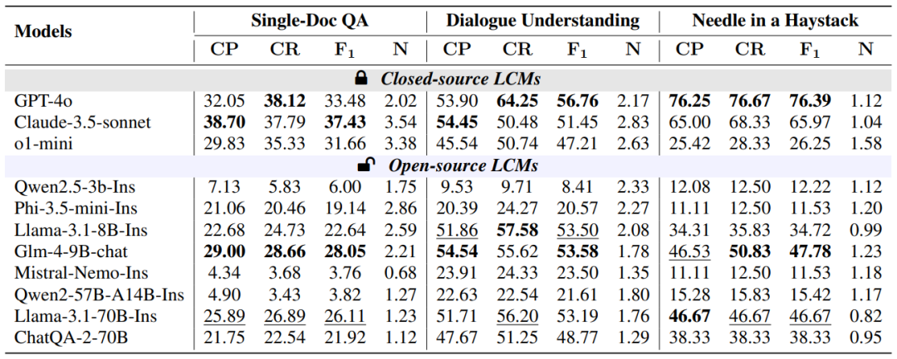
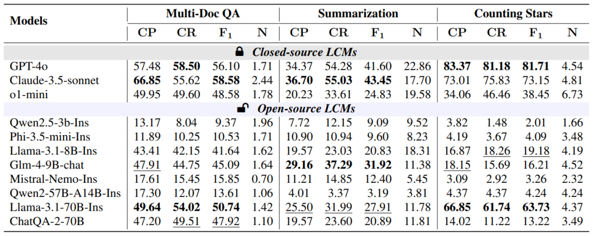
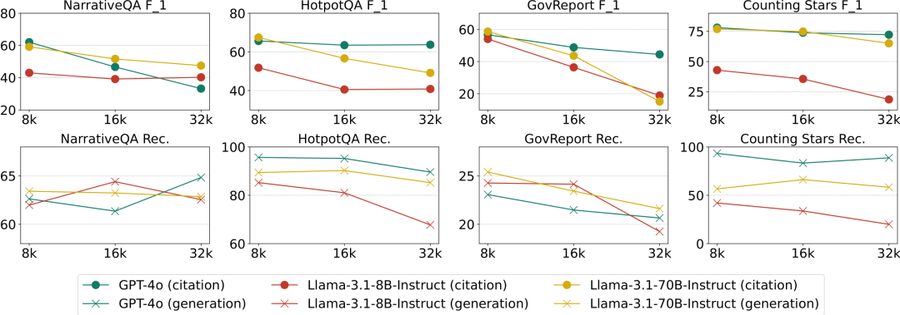
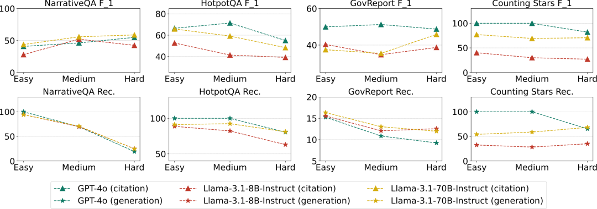
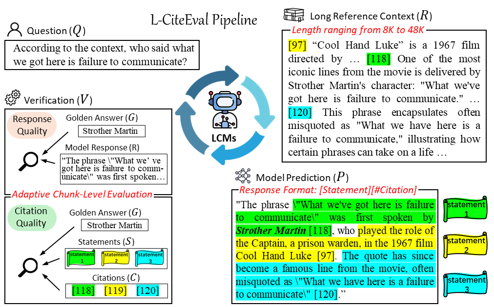
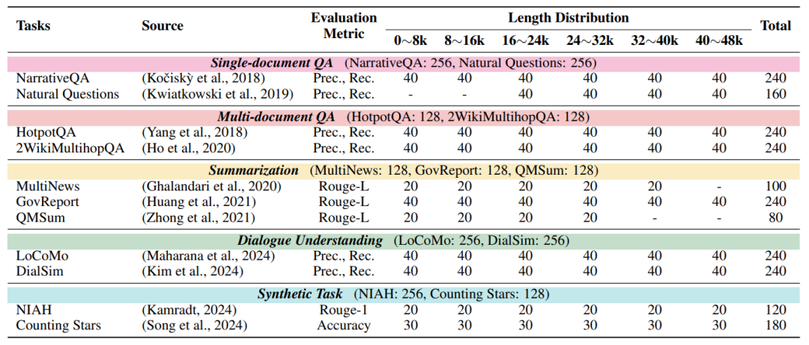
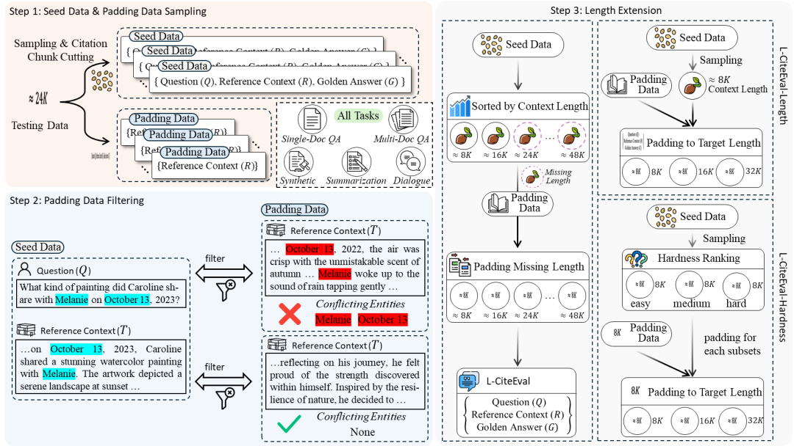

# L-CITEEVAL: DO LONG-CONTEXT MODELS TRULY LEVERAGE CONTEXT FOR RESPONDING?

**Paper** [](https://arxiv.org/abs/2410.02115) &nbsp; **Zhihu** [](https://zhuanlan.zhihu.com/p/817442176)

## 🚀 Update  [](https://github.com/ZetangForward/L-CITEEVAL) &nbsp;

- 2024/10/04 Code & Data will be released in a week.
- 2024/10/06 Code & Data are released. **L-CiteEval-Hardness** and **L-CiteEval-Length** data will be released soon.
- 2024/10/07 Format of Code & Data are fixed. **L-CiteEval-Hardness** and **L-CiteEval-Length** data are released.
  - We upload the data in Huggingface and remove the /data folder in this repo.

## 🔍 Benchmark Quickview

*L-CiteEval* is a multi-task long-context understanding with citation benchmark, covering **5 task categories**, including single-document question answering, multi-document question answering, summarization, dialogue understanding, and synthetic tasks, encompassing **11 different long-context tasks**. The context lengths for these tasks range from **8K to 48K**.
More details can be found in the **Q & A** part at the bottom.

## ⚙️ Preparation

### Environment

Make sure you are in this project folder and then run:

```
conda activate /your/env_name 
pip install -r requirements.txt
```

### Data Prepare
You can load and check L-CiteEval data using the following code:
```
from datasets import load_dataset

datasets = ["narrativeqa", "natural_questions", "hotpotqa", "2wikimultihopqa", "goc_report", "multi_news", "qmsum", "locomo", "dialsim", "counting_stars", "niah"]

for dataset in datasets:
    ### Load L-CiteEval
    data = load_dataset('Jonaszky123/L-CiteEval', f"L-CiteEval-Data_{dataset}")

    ### Load L-CiteEval-Length
    data = load_dataset('Jonaszky123/L-CiteEval', f"L-CiteEval-Length_{dataset}")

    ### Load L-CiteEval-Hardness
    data = load_dataset('Jonaszky123/L-CiteEval', f"L-CiteEval-Hardness_{dataset}")
```

We recommand using the code below to download L-CiteEval data from [🤗 Hugging face](https://huggingface.co/datasets/ZetangForward/L-CiteEval). Once downloaded, place the data in the ```/data``` folder.
```
huggingface-cli download --repo-type dataset --resume-download ZetangForward/L-CiteEval --local-dir data/
```

All data in L-CiteEval follows the format below:

```
{
    "id": "The identifier for the data entry",
    "question": "The task question, such as for single-document QA. In summarization tasks, this may be omitted",
    "answer": "The correct or expected answer to the question, used for evaluating correctness",
    "docs": "Context divided into fixed-length chunks"
    "length": "The length of the context"
    "hardness": "The level of difficulty in L-CiteEval-Hardness, which can be easy, medium and hard"
}
```

## 🤖️ Inference & Evaluation

### Inference

We recommend using vllm to deploy the model for inference. Relevant examples can be found in the script folder.

```
bash script/inference.sh
```

### Evaluate the results

You can also evaluate the results generated by your model using a format similar to the one below. Simply modify the parameter to match your local path.

```
### Parameter Explanation
# file: Specify the path to your file
# exp: Define the experiment class, choosing between 'l-citeeval' (main experiment, L-CiteEval),  'l-citeeval-length' and 'l-citeeval-hardness'
# task: Specify the dataset to be evaluated(narrativeqa, natural_questions, hotpotqa, etc.)
# model: the name of your model

### Evaluate Citation Quality
# <note: task can be {niah, counting_stars, others}> 
python script/eval_citation.py --file result/l-citeeval/niah/1shot_Meta-Llama-3.1-8B-Instruct.json --exp l-citeeval --task niah  

### Evaluate Generation Quality
python script/eval_correct.py --file result/l-citeeval-length/niah/1shot_Meta-Llama-3.1-8B-Instruct.json --exp l-citeeval --task niah --model Meta-Llama-3.1-8B-Instruct
```

## 📊 Evaluation Results

Our evaluation currently includes the most commonly used long-context models (reported ctx length >= 64K), covering both closed-source and open-source models of different sizes and architectures.



We also propose L-CiteEval-Length and L-CiteEval-Hardness (will be released soon). As two variants of the L-CiteEval benchmark, they aim to evaluate the performance of long-text models from the perspectives of different context lengths and varying levels of difficulty.



## 🌟 Q & A (See more details here)

### Q1: How the benchmark works?

In the L-CiteEval benchmark, the model is required to generate a response (R) based on the question (Q) and the provided long reference context (R). To ensure the accuracy and verifiability of the response, the model is required to generate responses in a specific format, where each statement (S) is followed by a corresponding citation (C). This format facilitates a comprehensive evaluation of the model's response during the verification (V) phase.


### Q2: How to evaluate the results?

For generation quality of different tasks, we provide corresponding automatic evaluation metrics. The assessment of citation quality follows a unified standard, which includes three metrics: Citation Recall (CR), Citation Precision (CP), and Citation F1 Score (F1).


### Q3: How the benchmark is created?

The specific process for creating test data consists of three steps: Seed Data & Padding Data Sampling, Padding Data Filtering, and Length Extension.


## 📝 Citation

If you find our work helpful, please cite our paper:

```
@misc{tang2024lciteeval,
    title={L-CiteEval: Do Long-Context Models Truly Leverage Context for Responding?},
    author={Zecheng Tang and Keyan Zhou and Juntao Li and Baibei Ji and Jianye Hou and Min Zhang},
    year={2024},
    eprint={2410.02115},
    archivePrefix={arXiv},
    primaryClass={cs.CL}
}
```
